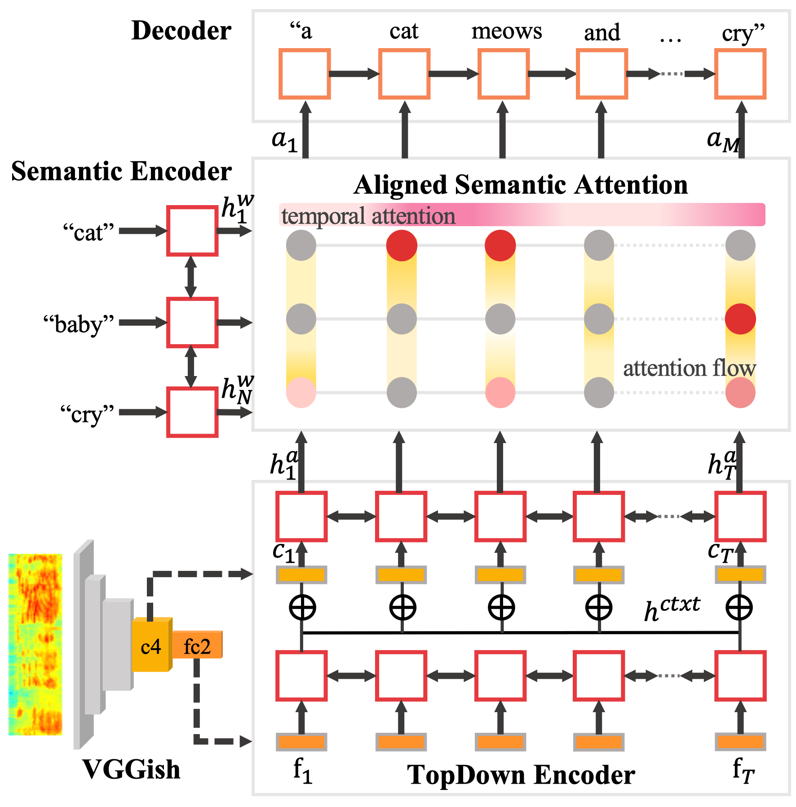

# Code

Top-Down Aligned Attention Model
-----




Dependencies
-----

- Python 3.6

Setup Instructions
-----

1. Install python modules & Tensorflow-gpu 1.10.0 (make sure to meet the CUDA, CUDNN requirements).

```bash
pip install -r requirements.txt
```

2. [Download](https://drive.google.com/drive/folders/1m-IZ0LuNhRkY3la9Ces6toW2cyKax-UN?usp=sharing) both (`vggish_conv4_pad` and `vggish_last_pad`)
 of the VGGish layer features we used for our NAACL-HLT2019 submission at this and place them in `data/audiocaps/features`.
Feel free to do this on our most recent dataset update from [updated dataset](https://github.com/cdjkim/audiocaps/tree/master/dataset) using the VGGish link in the Related Projects section.

```bash
# in code folder
mkdir -p data/audiocaps/features/auxiliary
unzip naacl19_data_auxiliary.zip -d data/audiocaps/features/auxiliary
```

3. Prepare the pretrained word embeddings.
* We used crawl-300d-2M vector from [fasttext](https://fasttext.cc/docs/en/english-vectors.html).

```bash
wget https://dl.fbaipublicfiles.com/fasttext/vectors-english/crawl-300d-2M.vec.zip
mkdir -p data/pretrained_word_vectors/fastText.commoncrawl
unzip crawl-300d-2M.vec.zip -d data/pretrained_word_vectors/fastText.commoncrawl/
```

4. Setup Stanford CoreNLP 3.6.0 code for SPICE:

```bash
./get_stanford_models.sh
```

To Train.
-----

```bash
./run_train.sh
```


Try our pretrained model.
-----

Our pretrained weights can be downloaded [here](https://drive.google.com/file/d/1vJudmKJwUf02n93KhcamJ9TdOdV4PEan/view?usp=sharing)

```bash
mkdir -p checkpoints/audiocaps/PyramidLSTM/
unzip audiocaps_pretrained.zip -d checkpoints/audiocaps/PyramidLSTM/audiocaps_pretrained/
./run_eval.sh
```


### Related Projects
- [VGGish](https://github.com/tensorflow/models/tree/master/research/audioset)
- [SoundNet](https://github.com/cvondrick/soundnet)
